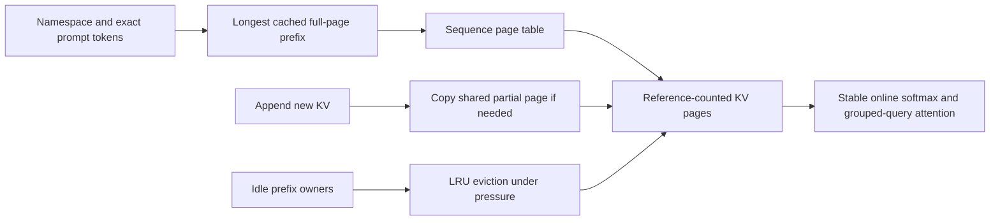

# kv-weave

[](https://github.com/yafi-s/kv-weave/actions/workflows/ci.yml)

**Paged KV storage, prefix reuse, and real reference attention in dependency-free Rust.**

Serving many requests with the same system prompt wastes memory when each request
owns a complete copy of its attention keys and values. Kv-weave shares immutable
prefix pages, copies a shared partial page on write, and evicts idle cached
prefixes when the bounded page pool fills. A numerically stable CPU grouped-query
attention kernel consumes the paged storage directly.

In the recorded 32-request shared-prefix experiment, allocated KV payload falls
from **1,310,720 to 294,912 bytes (77.5%)**. Both configurations produce identical
attention outputs. The experiment includes prefix construction; it does not load
a language model or measure end-to-end inference throughput.

Relevant to inference infrastructure at AI labs and model-serving platforms.
Independent research prototype, built with AI assistance; no employer affiliation
or production deployment is claimed.

## Run

Rust 1.85+, no external crates.

```sh
cargo test --locked
cargo clippy --locked --all-targets -- -D warnings
cargo run --release --example experiment
```

The experiment creates 32 sequences containing a shared 64-token prefix and
8 private tail tokens, evaluates single-position attention, compares complete
outputs, and releases every owner before checking that no pages remain live.



## Engineering mechanisms

| Concern | Mechanism |
| --- | --- |
| Repeated prompts | Exact token-prefix matching within model, revision, and tenant namespace |
| Branching generation | Forked page tables with partial-page copy on write |
| Bounded KV payload | Fixed page budget, explicit exhaustion, idle-prefix eviction |
| Ownership correctness | References held by both sequences and cache entries; executable invariant audit |
| Numerical stability | Online softmax with a running maximum and f64 accumulation |
| Grouped-query attention | Multiple query heads map to each stored KV head |
| Correctness evidence | Independent dense attention oracle and a 10,000-operation ownership model |

[Ownership and numerical design](docs/DESIGN.md) · [Measurements](docs/BENCHMARKS.md)
· [Tests](tests/cache.rs) · [Review guide](docs/REVIEW.md)

## Integration contract

`checkout(namespace, prompt)` returns a sequence and the number of reused tokens.
It installs **only the reused prefix**. The caller computes and appends KV for the
remaining prompt tokens. `publish_prefix` exposes the largest full-page prefix;
`fork` shares an existing sequence; `release` relinquishes a sequence's ownership.

The caller must encode every KV-affecting choice in the namespace: model weights,
adapters, positional scheme, attention configuration, and preprocessing revision.
The tenant field prevents accidental cross-tenant prefix lookup but is not an
authentication or memory-isolation boundary. A conflicting publication with the
same namespace and exact tokens but different KV values returns an error.

## Scope and next experiments

This is a single-layer CPU reference. It accepts already-computed f32 keys, values,
and queries; it has no tokenizer, weights, projection layers, GPU kernels,
continuous batching scheduler, distributed transport, or generation endpoint.
Mutation uses exclusive Rust access; deployment-level concurrency is a separate
integration problem. Allocator failure can still terminate the process.

The cache scans at most 128 prefix entries. A radix index, GPU page-table kernel,
and multi-layer admission policy would each require separate implementation and
measurement. Allocated payload counters exclude metadata, allocator overhead,
and process RSS. Prefix reuse avoids recomputing stored tensors in this workload;
it does not make attention stop reading the prefix.

The [PagedAttention paper](https://arxiv.org/abs/2309.06180) motivates paged KV
management. This is an independent, much smaller reference implementation and
does not reproduce vLLM's kernels or performance results.

MIT licensed.
